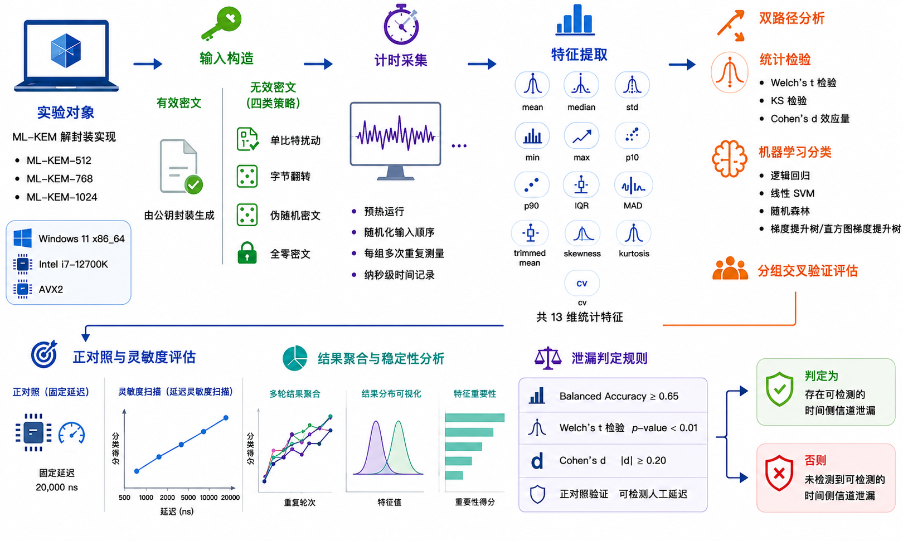

# ML-KEM Timing Leakage Detection

基于统计检验和机器学习的 ML-KEM 解封装时间侧信道筛查实验。

本仓库提供一套可复现的软件计时实验，用于观察 `pqcrypto` 中 ML-KEM
解封装实现面对有效密文和无效密文时，是否表现出稳定、可分类的执行时间差异。
它适合作为课程论文、实验报告或实现级侧信道筛查的基础工程。

> 重要边界：本项目不是密钥恢复攻击，也不能证明某个实现“没有侧信道风险”。
> 它只回答一个更窄的问题：在当前软件计时条件、当前输入构造策略和当前分析阈值下，
> 是否检测到可区分的时间信号。

## What This Project Does

- 采集 ML-KEM 解封装时间数据。
- 对比有效密文与多种无效密文策略。
- 使用统计检验和分组机器学习评估可区分性。
- 使用正对照验证检测管线能识别已知时间信号。
- 支持 ML-KEM-512、ML-KEM-768、ML-KEM-1024。
- 生成 CSV、JSON、Markdown 报告和论文图表。



## Repository Layout

```text
.
├── README.md
├── RUN_EXPERIMENTS_README.md
├── pyproject.toml
├── requirements.txt
├── requirements-dev.txt
├── docs/
│   ├── PAPER_DRAFT.md
│   ├── paper.tex
│   ├── paper.pdf
│   ├── references.bib
│   └── figures/
├── scripts/
│   ├── run_paper_experiments.sh
│   ├── run_local_experiments.sh
│   ├── generate_figures.py
│   ├── build_variant_figures.py
│   ├── plot_mde_sweep.py
│   └── aggregate_paper_stats.py
├── src/
│   └── mlkem_leakage/
│       ├── collector.py
│       ├── analysis.py
│       ├── paper_artifacts.py
│       ├── palette.py
│       └── cli.py
└── tests/
    └── test_collector.py
```

Generated experiment outputs are written under `results/`. That directory is intentionally
ignored by Git because repeated runs can become large.

## Quick Start

Create a virtual environment and install the project:

```bash
python3 -m venv .venv
source .venv/bin/activate
python -m pip install --upgrade pip
python -m pip install -r requirements.txt
python -m pip install -r requirements-dev.txt
python -m pip install -e .
```

Run the test suite:

```bash
.venv/bin/python -m pytest -q
```

Expected result:

```text
5 passed
```

Run a small smoke experiment:

```bash
.venv/bin/python -m mlkem_leakage.cli \
  --output-dir results/smoke_test \
  --samples-per-class 40 \
  --repetitions 5 \
  --groups 5 \
  --warmup 20 \
  --variants 768 \
  --invalid-strategies single_bit
```

Run the default experiment:

```bash
.venv/bin/python -m mlkem_leakage.cli
```

The default output directory is:

```text
results/latest/
```

## Experiment Design

Each run creates a fresh ML-KEM keypair, encrypts base ciphertexts, derives matching invalid
ciphertexts, randomizes measurement order, and measures decapsulation time with
`time.perf_counter_ns()`.

Two scenarios are collected:

| Scenario | Meaning | Purpose |
| --- | --- | --- |
| `real` | Direct timing of valid vs invalid ciphertext decapsulation | Detect possible implementation-level timing differences |
| `positive_control` | Same pipeline, but invalid ciphertexts receive an artificial delay | Confirm the collection and analysis pipeline can detect a known signal |

The positive control is essential. If the positive control fails, a negative real result is not
very informative because the detector may simply be too weak for the current settings.

## Ciphertext Strategies

Invalid ciphertexts always preserve the original ciphertext length so the experiment focuses on
decapsulation behavior rather than trivial length rejection.

| Strategy | Description |
| --- | --- |
| `single_bit` | Flip one deterministic bit selected from `group_id` through SHA-256 |
| `byte_flip` | Flip all bits in one deterministic byte |
| `random_bytes` | Replace the ciphertext with deterministic pseudorandom bytes of equal length |
| `zero` | Replace the ciphertext with all zero bytes of equal length |

Labels in generated CSV files:

| Label | Meaning |
| ---: | --- |
| `0` | Valid ciphertext |
| `1` | Invalid or altered ciphertext |

## Analysis Pipeline

For each aggregate trace, the collector repeats decapsulation several times and summarizes the
timing distribution. The current feature set includes:

```text
mean_ns, median_ns, std_ns, min_ns, max_ns,
p10_ns, p90_ns, iqr_ns, mad_ns,
trimmed_mean_ns, skewness, kurtosis, cv
```

The analysis then applies:

| Method | Purpose |
| --- | --- |
| Welch's t-test | Compare class means without assuming equal variance |
| Mann-Whitney U test | Compare rank distributions |
| Kolmogorov-Smirnov test | Compare full one-dimensional distributions |
| Cohen's d | Estimate practical effect size |
| Permutation test | Check whether model scores exceed label-shuffled baselines |
| Grouped train/test split | Keep traces from the same base ciphertext group on one side of the split |

Machine-learning models:

| Model | Notes |
| --- | --- |
| `logistic_regression` | Linear baseline with robust scaling |
| `linear_svm` | Margin-based linear classifier with robust scaling |
| `random_forest` | Nonlinear tree ensemble and feature importance source |
| `hist_gradient_boosting` | Gradient boosting baseline for nonlinear structure |

The main classification metric is balanced accuracy. Random guessing is expected to be near `0.5`.

## Leakage Decision Rule

The `real` scenario reports `leakage_detected: true` only when all of these conditions hold:

| Condition | Threshold |
| --- | ---: |
| Best grouped balanced accuracy | `>= 0.65` |
| Welch p-value | `< 0.01` |
| Absolute Cohen's d | `>= 0.2` |

The positive-control pipeline reports valid only when:

| Condition | Threshold |
| --- | ---: |
| Best grouped balanced accuracy | `>= 0.90` |
| Welch p-value | `< 0.001` |

These thresholds are conservative project rules, not a general cryptographic certification
standard.

## Command Line Usage

Show the full CLI help:

```bash
.venv/bin/python -m mlkem_leakage.cli --help
```

Installed console script:

```bash
mlkem-leakage --help
```

Key options:

| Option | Default | Description |
| --- | ---: | --- |
| `--output-dir` | `results/latest` | Directory for generated outputs |
| `--samples-per-class` | `400` | Aggregate traces per label |
| `--repetitions` | `50` | Decapsulations per aggregate trace |
| `--groups` | `40` | Number of independent base ciphertext groups |
| `--warmup` | `500` | Warmup decapsulations before measurement |
| `--seed` | `20260602` | Random seed for ordering and splits |
| `--control-delay-ns` | `20000` | Artificial positive-control delay |
| `--variants` | `768` | One or more of `512 768 1024` |
| `--invalid-strategies` | `single_bit` | One or more invalid ciphertext strategies |
| `--delay-sweep` | none | Positive-control sensitivity sweep over delay values |

Example comparing variants and invalid strategies:

```bash
.venv/bin/python -m mlkem_leakage.cli \
  --output-dir results/comparison_run \
  --variants 512 768 1024 \
  --invalid-strategies single_bit byte_flip random_bytes zero
```

Example delay sweep:

```bash
.venv/bin/python -m mlkem_leakage.cli \
  --output-dir results/delay_sweep_run \
  --samples-per-class 120 \
  --repetitions 20 \
  --groups 20 \
  --delay-sweep 500 1000 2000 5000 10000 20000
```

## Output Files

A single run writes files like these:

| File | Description |
| --- | --- |
| `REPORT.md` | Short human-readable result summary |
| `summary.json` | Parameters, environment metadata, and all scenario results |
| `real_traces.csv` | Aggregate traces for the real scenario |
| `real_raw_timings.csv` | Per-repetition timings for the real scenario |
| `real_analysis.json` | Statistical tests and model results for the real scenario |
| `real_timing_histogram.png` | Real timing distribution plot |
| `real_feature_importance.png` | Random-forest feature importance for real traces |
| `positive_control_traces.csv` | Aggregate traces for the positive control |
| `positive_control_raw_timings.csv` | Per-repetition timings for the positive control |
| `positive_control_analysis.json` | Statistical tests and model results for the positive control |
| `positive_control_timing_histogram.png` | Positive-control timing distribution plot |
| `positive_control_feature_importance.png` | Random-forest feature importance for positive-control traces |

For paper-scale repeated runs, use `summary.json` for tables and `*_traces.csv` for deeper
diagnostics.

## Paper-Scale Reproduction

The full experiment driver is:

```bash
source .venv/bin/activate
LOKY_MAX_CPU_COUNT=8 MLKEM_PERMUTATIONS=20 bash scripts/run_paper_experiments.sh
```

Default matrix:

| Parameter | Default |
| --- | ---: |
| Runs | `5` |
| Variants | `512 768 1024` |
| Invalid strategies | `single_bit byte_flip random_bytes zero` |
| Samples per class | `400` |
| Repetitions | `50` |
| Groups | `60` |
| Warmup | `500` |

The default full matrix produces `60` completed run directories:

```text
5 runs x 3 variants x 4 strategies = 60 summaries
```

Use a smaller matrix for quick validation:

```bash
RUNS=1 \
SAMPLES_PER_CLASS=20 \
REPETITIONS=5 \
N_GROUPS=5 \
VARIANTS="768" \
INVALID_STRATEGIES="single_bit" \
MLKEM_PERMUTATIONS=5 \
bash scripts/run_paper_experiments.sh
```

The paper driver writes:

```text
results/paper_runs/
results/paper_artifacts/
```

Generated paper artifacts include:

| File | Description |
| --- | --- |
| `DATA_QUALITY_REPORT.md` | Data integrity and quality audit |
| `data_quality.json` | Machine-readable audit details |
| `real_distribution.png` | Real timing distribution across runs |
| `positive_control_distribution.png` | Positive-control timing distribution |
| `model_accuracy_comparison.png` | Model balanced-accuracy comparison |
| `run_stability.png` | Cross-run timing-difference stability |
| `trace_order_diagnostic.png` | Collection-order drift diagnostic |

More detailed remote-machine instructions are in `RUN_EXPERIMENTS_README.md`.

## Environment Variables

The analysis and scripts expose a few useful knobs:

| Variable | Default | Description |
| --- | ---: | --- |
| `MLKEM_PERMUTATIONS` | `200` | Number of permutations for model significance testing |
| `MLKEM_N_JOBS` | `1` | scikit-learn parallelism for supported models/tests |
| `LOKY_MAX_CPU_COUNT` | unset | Optional joblib CPU-count hint, useful on macOS |
| `PYTHON` | `.venv/bin/python` | Python interpreter used by paper scripts |
| `OUTPUT_ROOT` | `results/paper_runs` | Repeated-run output root |
| `RUNS` | `5` | Number of independent repeated runs |
| `SAMPLES_PER_CLASS` | `400` | Aggregate traces per label |
| `REPETITIONS` | `50` | Decapsulations per aggregate trace |
| `N_GROUPS` | `60` | Base ciphertext groups in paper runs |
| `WARMUP` | `500` | Warmup decapsulations |
| `VARIANTS` | `512 768 1024` | Variants used by the paper driver |
| `INVALID_STRATEGIES` | `single_bit byte_flip random_bytes zero` | Strategies used by the paper driver |

## Reproducibility Notes

For more stable timing data:

- Run on AC power and avoid low-power mode.
- Close browsers, sync clients, compilers, downloads, and backup jobs.
- Let the machine reach a stable thermal state before long runs.
- Avoid heavy disk and network activity during collection.
- Keep raw CSV and JSON summaries so results can be re-audited.
- Interpret negative findings only when the positive control is valid.

Software timing is noisy. The project keeps outliers in the data rather than silently deleting
them, because scheduler noise and transient system behavior are part of the measurement context.

## Development

Run tests:

```bash
.venv/bin/python -m pytest -q
```

Run a focused module directly:

```bash
.venv/bin/python -m mlkem_leakage.cli --help
.venv/bin/python -m mlkem_leakage.paper_artifacts --help
```

Primary implementation files:

| File | Responsibility |
| --- | --- |
| `src/mlkem_leakage/collector.py` | Key generation, ciphertext mutation, timing collection, CSV writing |
| `src/mlkem_leakage/analysis.py` | Statistical tests, ML models, plots, leakage decision rule |
| `src/mlkem_leakage/cli.py` | CLI orchestration for single and multi-variant runs |
| `src/mlkem_leakage/paper_artifacts.py` | Data-quality audit and repeated-run figures |
| `tests/test_collector.py` | Unit tests for mutation strategies and trace balance |

## Current Scope and Limitations

- The experiment targets timing behavior of selected `pqcrypto` ML-KEM bindings.
- Labels distinguish valid and invalid ciphertexts, not private-key bits.
- The project does not implement an adaptive chosen-ciphertext attack.
- The project does not attempt key recovery.
- Results from one OS, CPU, Python version, or library build should not be generalized blindly.
- No detected leakage means “not detected under this setup,” not “proven secure.”

## Suggested Wording for Reports

Careful statement:

> Under this software-only timing setup, for the tested ML-KEM variants and invalid-ciphertext
> strategies, the experiment did or did not detect stable timing differences according to the
> project's statistical and grouped machine-learning thresholds. The positive control should be
> reported alongside the real scenario because it validates whether the detection pipeline was
> sensitive enough to identify a known injected timing signal.

Avoid claiming:

```text
ML-KEM has no side-channel leakage.
```

That conclusion is broader than this experiment can support.
